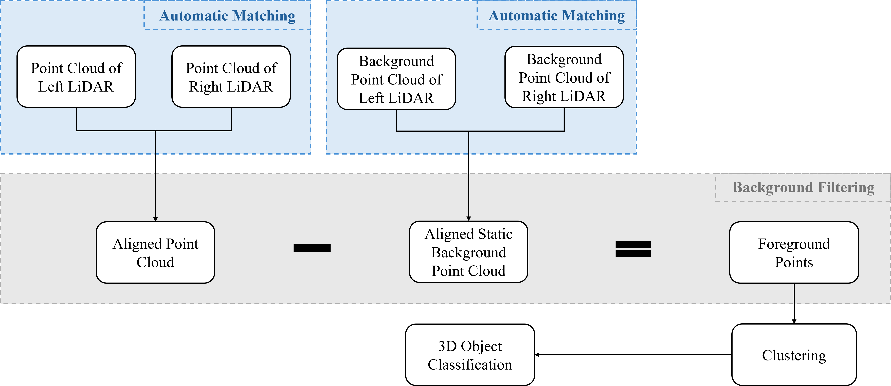
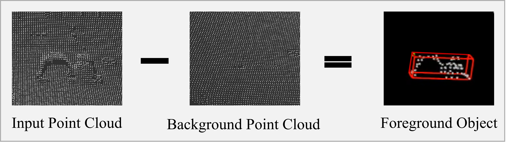
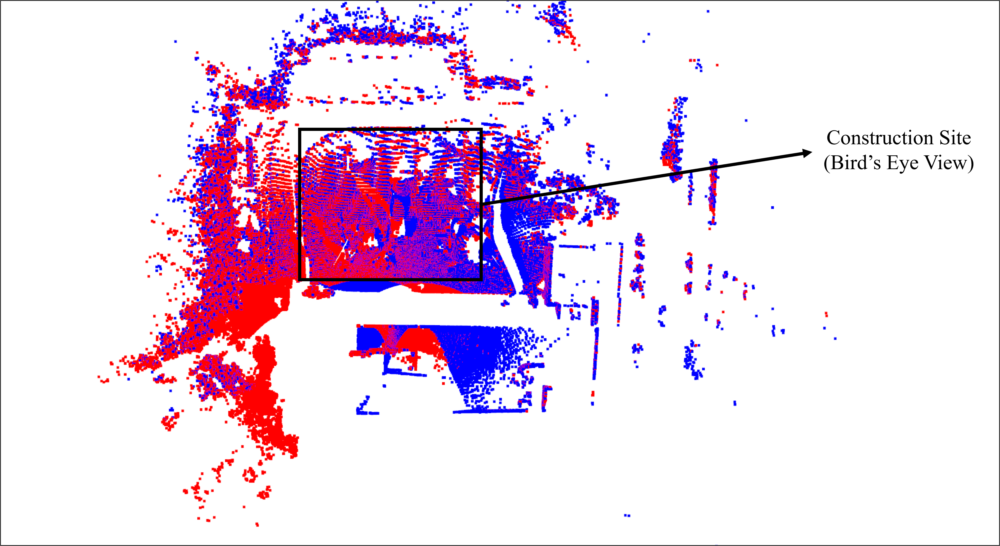
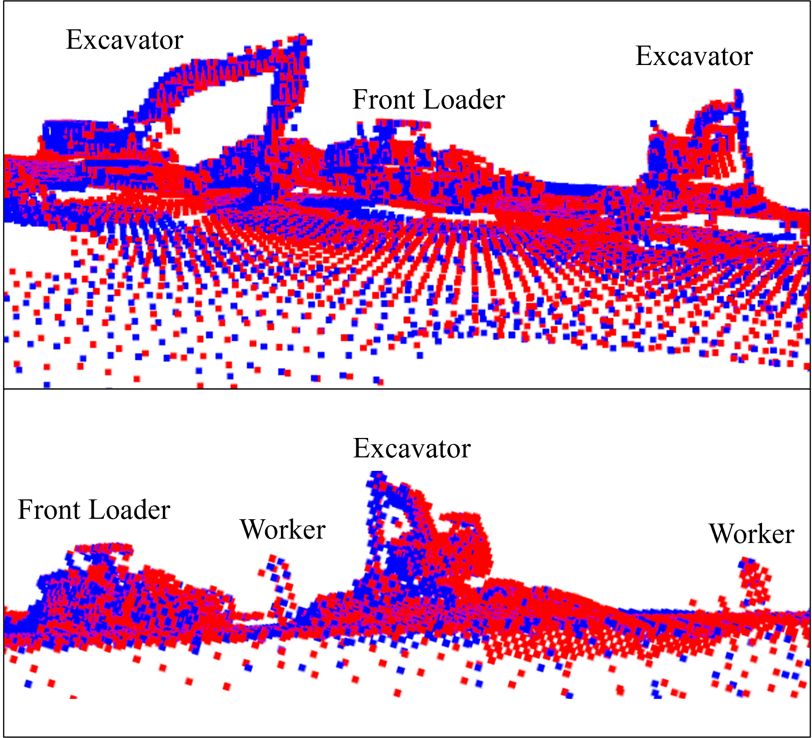

# Dual-LiDAR 3D Object Detection for Construction Site

## Dual-LiDAR Point Cloud Fusion with Automatic Alignment for Enhanced 3D Object Detection in Construction Site Environments

#### [[Paper]](https://)

[[Chao He]](https://scholar.google.com/citations?user=g4Yv3BkAAAAJ&hl=en) and [[Da Hu]](https://scholar.google.com/citations?user=Y7_j-GMAAAAJ&hl=en&oi=ao) 

Kennesaw State University

This is the project page for [[Paper]](https://)

The proposed system employs two LiDAR sensors positioned 24 meters apart, with an automatic alignment pipeline combining Fast Point Feature Histogram (FPFH) descriptors and Iterative Closest Point (ICP) registration to precisely merge the two point clouds. The system performs coarse-to-fine alignment through RANSAC-based global registration followed by point-to-plane ICP refinement, achieving robust fusion without manual intervention. The merged point cloud provides enhanced spatial coverage and reduced occlusion compared to single-sensor configurations. We integrate this dual-LiDAR framework with our background filtering method to enable accurate 3D object detection of construction vehicle and personnel

<div align="center">
  <br>
  <strong>Figure 1.</strong> Complete System Workflow.
</div>
<br><br>


<div align="center">
  <br>
  <strong>Figure 2.</strong> The Setup of the Data Collection (note: for visualization purposes, the LiDAR sensors appear closer together in this photograph than their actual deployment configuration. The operational sensor separation during data collection is 24 meters; photographing at true scale would render the individual sensors too small to distinguish clearly.).
</div>
<br><br>


<div align="center">
  <br>
  <strong>Figure 3.</strong> Background Filtering (the foreground object is an excavator.).
</div>
<br><br>

<div align="center">
  <br>
  <strong>Figure 4.</strong> Background Reconstruction in Bird’s Eye View.
</div>
<br><br>

<div align="center">
  <br>
  <strong>Figure 5.</strong> Bird's Eye View Visualization of Entire Construction Site (red: left LiDAR, blue: right LiDAR).
</div>
<br><br>

<div align="center">
  <br>
  <strong>Figure 6.</strong> Details of Objects after Automatic Alignment (red: left LiDAR, blue: right LiDAR).
</div>
<br><br>

<div align="center">
  <br>
  <strong>Figure 7.</strong> Bird's Eye View of Results for Single-LiDAR System (Left) and Dual-LiDAR system (Right) (red: excavator, green: worker).
</div>
<br><br>


## 1. Data
**Data** : 
[[bin]](https://github.com/Saturn-Chao-He/dual-LiDAR-object-detection/tree/main/bin)

## 2. Environment (Ubuntu 20.04, ROS 1 Noetic)

Create Python environment and install the required packages:
```bash
conda env create -f dual.yaml
conda activate dual

```

## 3. Ternimal 1
Run
```bash
export DISABLE_ROS1_EOL_WARNINGS=1
source /opt/ros/noetic/setup.bash
roscore
```

## 4. Ternimal 2
Run
```bash
rviz -d detect.rviz -f velodyne
```

## 5. VSCode
Run
```bash
# conda env: dual
export DISABLE_ROS1_EOL_WARNINGS=1
source /opt/ros/noetic/setup.bash
python detect.py
```


## Acknowledgement
Great thanks to the Q building of Kennesaw State University.

## Cite
If this project is useful in your research, please cite:
> He, C., & Hu, D. (2026). Dual-LiDAR Point Cloud Fusion with Automatic Alignment for Enhanced 3D Object Detection in Construction Site Environments.

Related paper:
> He, C., & Hu, D. (2026). A LiDAR-Driven Framework for Real-Time Monitoring and Speed Tracking on Construction Sites.

